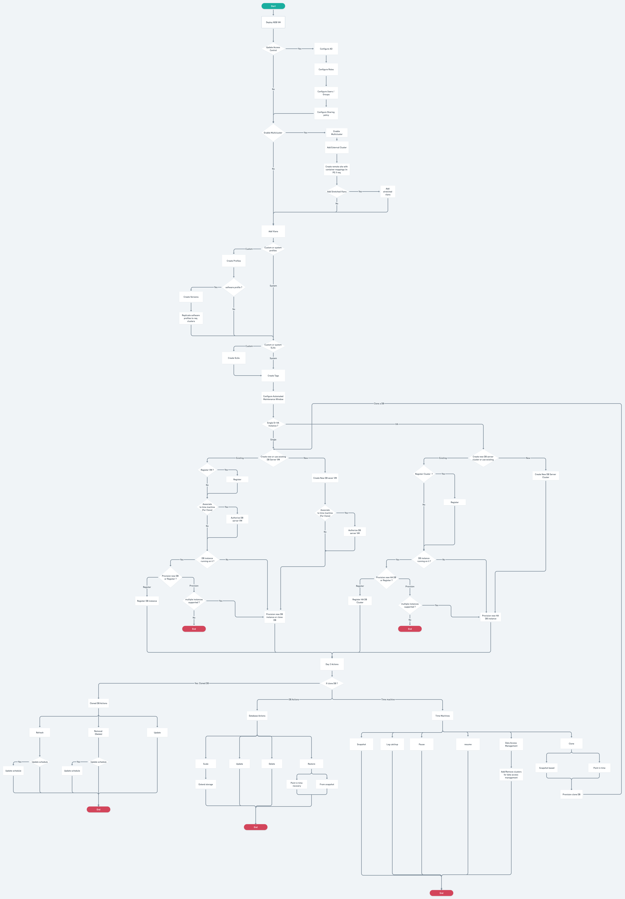

# Nutanix Database Service

Nutanix ansibe collection nutanix.ncp from v1.8.0 will contain modules for supporting Nutanix Database Service (NDB) features.

These modules are based on workflow :



Note: Access Control update and enabling multi-cluster in NDB is not yet supported by nutanix ansible provider.

## Usage

Below we will discuss usage of various NDB modules.

First, we need to configure NDB setup details in the playbook. This can be done either by using module_defaults or in each individual tasks.

```yaml
---
- name: NDB operations
  hosts: localhost
  gather_facts: false
  collections:
    - nutanix.ncp
  module_defaults:
    group/nutanix.ncp.ntnx:
      nutanix_host: <ndb_setup_ip>
      nutanix_username: <ndb_setup_username>
      nutanix_password: <ndb_setup_password>
      validate_certs: true
  tasks:
    - name: create tags
      nutanix.ncp.ntnx_ndb_tags:
        nutanix_host: <ndb_setup_ip>
        nutanix_username: <ndb_setup_username>
        nutanix_password: <ndb_setup_password>
        validate_certs: true
```

Initially on NDB setup, we add cluster, vlans or stretched vlans.

For example, playbook task to register AHV cluster in NDB setup is :

```yaml
- name: NDB cluster registration
  nutanix.ncp.ntnx_ndb_clusters:
    name: "<name>"
    desc: "<description>"
    name_prefix: "<prefix_for_agent_vm>"
    cluster_ip: "<cluster's_ip_address>"
    cluster_credentials:
      username: "<username>"
      password: "<password>"
    agent_network:
      dns_servers:
        - "<dns_ip1>"
        - "<dns_ip2>"
      ntp_servers:
        - "<ntp_server_address1>"
        - "<ntp_server_address1>"
        - "<ntp_server_address1>"
        - "<ntp_server_address1>"
    vlan_access:
      prism_vlan:
        vlan_name: "<vlan_name_for_agent_vm>"
        vlan_type: "<vlan_type>"
        static_ip: "<ip_address_for_agent_vm>"
        gateway: "<vlan_gateway>"
        subnet_mask: "<subnet_mask>"
    storage_container: "<storage_container_name>"
  register: output
```

Examples for adding vlans and stretched vlans can be found in module documentation or examples/ndb/ in our GitHub repository.

Currently, we only support postgres type databases.

Example playbook task to deploy single instance postgres type database in NDB is :

```yaml
- name: Create single instance postgres database
  nutanix.ncp.ntnx_ndb_databases:
    name: POSTGRES_DATABASE_ANSIBLE
    db_params_profile:
      name: DEFAULT_POSTGRES_PARAMS
    db_vm:
      create_new_server:
        name: postgres_server_ansible
        password: temp_password
        cluster:
          name: TempCluster
        software_profile:
          name: POSTGRES_10.4_OOB
        network_profile:
          name: DEFAULT_OOB_POSTGRESQL_NETWORK
        compute_profile:
          name: DEFAULT_OOB_SMALL_COMPUTE
        pub_ssh_key: "<publickey-for-vm-access>"

    postgres:
      listener_port: "5432"
      db_name: test_ansible
      db_password: db_password
      db_size: 200

    time_machine:
      name: POSTGRES_DATABASE_ANSIBLE_TM
      sla:
        name: "None"
```
